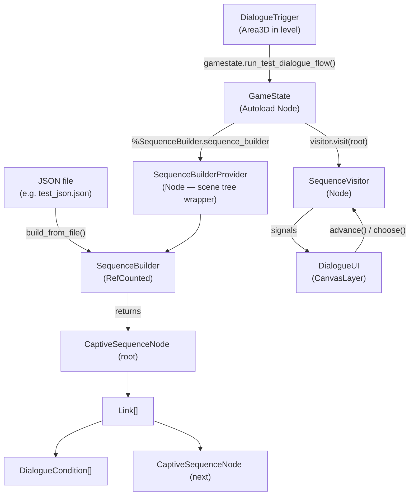
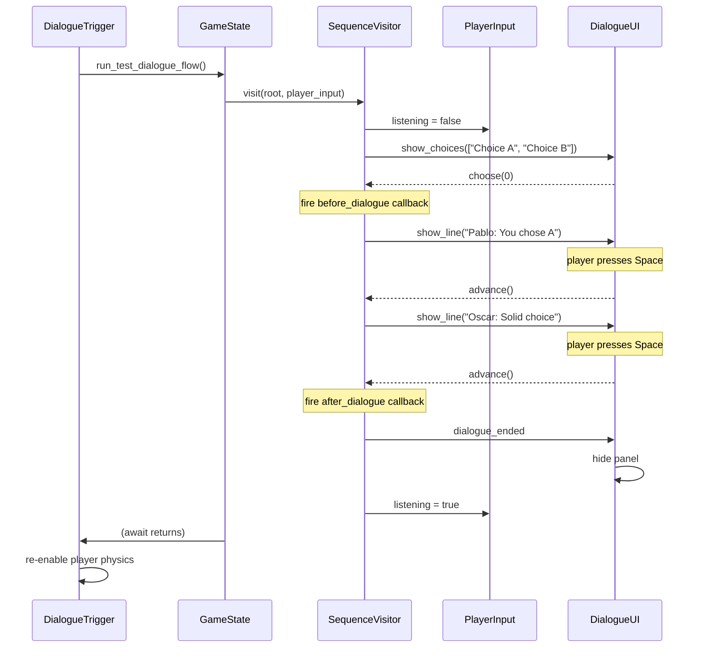

# Dialog System

The dialog system converts JSON conversation data into an interactive in-game dialogue with choices, conditions, and callbacks.

---

## High-level architecture



---

## Data model

A conversation file is a flat map of **node IDs → link data**. Each **node** holds one or more **links** (paths forward). A link is a single branch — it holds the text to display, the conditions that must pass for it to appear, the callbacks to fire, and an optional pointer to the next node.

```
CaptiveSequenceNode
├── id: String
└── links: Array[Link]
        ├── lines: Array[String]   # lines[0] = choice label; lines[1:] = body
        ├── conditions: Array[DialogueCondition]
        ├── callbacks: Dictionary  # "before_dialogue" | "after_dialogue" -> Callable
        └── next_node: CaptiveSequenceNode | null
```

When `next_node` is `null`, the conversation ends after that link.

---

## JSON format

```json
{
    "node_id": [                   // Array = multiple links (choice menu)
        {
            "conds": [             // Conditions that gate this link
                { "identifier": "is_guy_happy", "value": true }
            ],
            "text": [
                "Choice label",    // lines[0] — shown in the choice menu
                "Speaker: Line 1", // lines[1:] — shown sequentially in the text box
                "Speaker: Line 2"
            ],
            "callbacks": {
                "before_dialogue": [
                    { "identifier": "set_happy_acknowledged", "values": [false] }
                ],
                "after_dialogue": [
                    { "identifier": "clear_text_buffer", "values": [true] }
                ]
            },
            "next": "next_node_id" // Omit to end conversation here
        },
        {
            "conds": [],           // Empty = always available
            "text": ["Choice B", "..."]
        }
    ],
    "next_node_id": {              // Object = single link (no choice menu)
        "conds": [],
        "text": ["...", "..."]
    }
}
```

**Key rule:** if a node's value is an **Array**, each element is a separate link and the visitor shows a choice menu. If it is a **Dictionary**, there is only one link and it is followed silently.

---

## Parsing: SequenceBuilder

`SequenceBuilder` (`RefCounted`) owns the parse logic. It is wrapped by `SequenceBuilderProvider` (a `Node`) so it can be accessed from the scene tree via `%SequenceBuilder.sequence_builder`.

`build_from_file(filepath)` does two passes:

1. **Node pass** — iterates the top-level JSON keys. For each key it calls `process_node_entry`, which calls `process_link_entry` for each link dict. Every condition and callback identifier is resolved through the registries at parse time (see below). Nodes are stored in `node_id_to_node_map`.
2. **Link pass** — iterates `link_to_node_map` (populated during step 1) and calls `link.set_next_node(...)` to wire links to their target nodes. This is done as a second pass so forward references in the JSON work correctly.

Returns the first node encountered (the root of the graph).

---

## Registries

Conditions and callbacks are decoupled from the parser via two static classes. Both use `_static_init()` to populate themselves the first time they are accessed, with no autoload required.

### ConditionRegistry

Maps a `StringName` identifier to a `Callable` that takes a game-state `Variant` and returns `bool`.

```
"is_guy_happy"  ->  ConditionRegistry._is_guy_happy(convo_state) -> bool
                        reads GlobalState.get_flag("is_guy_happy")
```

### CallbackRegistry

Maps a `StringName` identifier to a `Callable` that is called before or after dialogue lines play.

```
"set_happy_acknowledged"  ->  CallbackRegistry._set_happy_acknowledged(value: bool)
                                  calls GlobalState.set_flag(&"is_guy_happy", value)

"clear_text_buffer"       ->  CallbackRegistry._clear_text_buffer(args)
```

Callbacks are bound to their argument values at parse time using `.bindv(values)`, so the visitor calls them with no arguments.

---

## Condition evaluation: DialogueCondition

`DialogueCondition` stores the callable and its arguments. `evaluate()` calls `eval_condition.callv(eval_args)` and returns the `bool` result. A link's `is_available()` returns `true` only when **all** of its conditions evaluate to `true`.

---

## Traversal: SequenceVisitor

`SequenceVisitor` is a `Node` added as a child of `GameState` at runtime. It drives the conversation loop and communicates with the UI purely through signals.



**Signals the visitor emits (connect UI to these):**

| Signal | When | UI action |
|---|---|---|
| `show_choices(choices: Array)` | Node has >1 available link | Display a button per choice; call `choose(i)` on press |
| `show_line(line: String)` | Each body line of the selected link | Show text; call `advance()` when dismissed |
| `dialogue_ended` | `next_node` is null | Hide the UI panel |

---

## UI: DialogueUI

`DialogueUI` is a `CanvasLayer` instanced in `game_state.tscn`. It sits above the 3D world and menu layers.

`bind(visitor)` connects to all three visitor signals and shows the panel. Once `dialogue_ended` fires, it disconnects itself and hides.

- **Lines** are shown in a `RichTextLabel`. The player presses `ui_accept` (Space/Enter) to advance. Input is consumed via `_unhandled_input` and only processed while `_awaiting_advance` is true.
- **Choices** create `Button` nodes dynamically inside a `VBoxContainer`. Keyboard focus is set to the first button automatically.

---

## Player halting

Halting happens at two levels:

| Layer | Mechanism |
|---|---|
| Input | `PlayerInput.listening = false` — set by `SequenceVisitor.visit()` at start, restored at end |
| Physics | `body.set_physics_process(false)` — called by `DialogueTrigger` before awaiting the flow; restored after |

---

## Adding new conditions or callbacks

Register them in `ConditionRegistry._static_init()` or `CallbackRegistry._static_init()`:

```gdscript
# ConditionRegistry.gd
static func _static_init() -> void:
    _conditions[&"my_condition"] = _my_condition

static func _my_condition(_args: Variant) -> bool:
    return GlobalState.get_flag(&"some_flag")
```

```gdscript
# CallbackRegistry.gd
static func _static_init() -> void:
    _callbacks[&"my_callback"] = _my_callback

static func _my_callback(value: Variant) -> void:
    GlobalState.set_flag(&"some_flag", value)
```

Then reference the identifier in JSON:

```json
"conds": [{ "identifier": "my_condition", "value": true }]
"callbacks": { "before_dialogue": [{ "identifier": "my_callback", "values": [true] }] }
```

---

## File map

| File | Role |
|---|---|
| `dialog_system/SequenceBuilder.gd` | Parses JSON into node/link graph |
| `dialog_system/SequenceBuilderProvider.gd` | Scene-tree wrapper so `GameState` can hold a `RefCounted` builder |
| `dialog_system/CaptiveSequenceNode.gd` | Graph node holding an array of links |
| `dialog_system/Link.gd` | One branch: text, conditions, callbacks, next node pointer |
| `dialog_system/DialogueCondition.gd` | Wraps a callable + args, evaluates to bool |
| `dialog_system/ConditionRegistry.gd` | Static map of condition identifiers to callables |
| `dialog_system/CallbackRegistry.gd` | Static map of callback identifiers to callables |
| `dialog_system/SequenceVisitor.gd` | Traverses the graph, emits UI signals, controls player input |
| `scenes/ui/dialogue_ui.gd` | CanvasLayer UI: renders lines and choice buttons |
| `scenes/ui/dialogue_ui.tscn` | Scene for the dialogue UI overlay |
| `scenes/levels/obliquetile/dialogue_trigger.gd` | Area3D that starts dialogue when player enters |
| `dialog_system/test_json.json` | Example conversation file |
